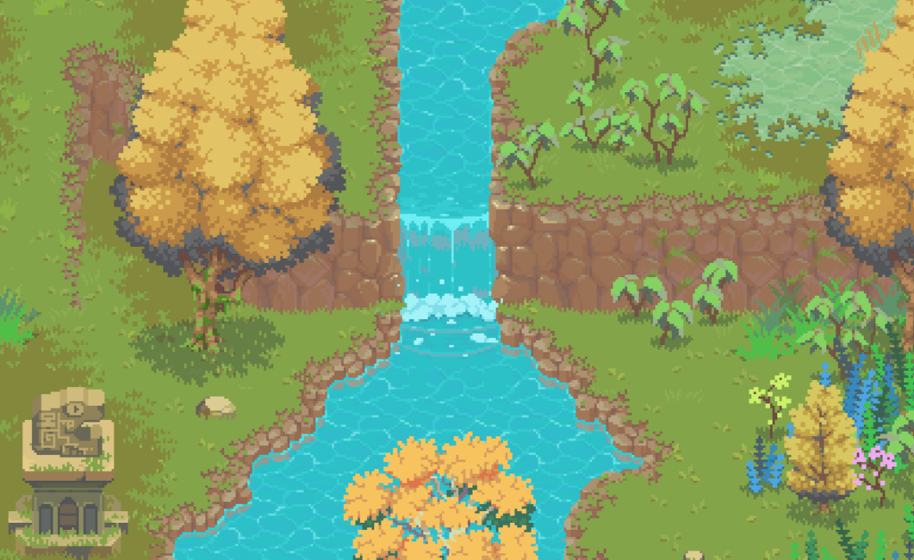

# Bevy Retro Camera

[](https://crates.io/crates/bevy_retro_camera)
[](https://docs.rs/bevy_retro_camera)
[](https://github.com/celerysaltgames/bevy_retro_camera)


<div align="center">
    <em>( Screenshot of <a href="https://rafaelmatos.itch.io/epic-rpg-world-pack-free-demoancient-ruins">Epic RPG World - Ancient Ruins </a> rendered with Bevy and this crate )</em>
</div>



Bevy Retro camera is a 2D, pixel-perfect camera for Bevy.  It does work for **Bevy 0.8**.


## Features

- Easy to configure camera optimized for 2D pixel-art rendering.
- Plugin that improve Bevy's rendering for pixel art -> Will save you hours of "Why my pixels are blurs ?"

## Quickstart
Create a startup system and use `RetroCameraBundle` to create a camera. It's also recommended to add the `RetroCameraPlugin` to disable the blur effect due to Bevy's default rendering configuration.

```rust
// Add RetroCameraPlugin to you app + a startup system
fn main() {
    App::new()
        .add_plugin(RetroCameraPlugin)
        .add_startup_system(setup)
}

// Configure your startup system
fn setup(mut commands: Commands) {
    let height: f32 = 240.0;  // Viewport size
    let scale: f32 = 1.0;  // Viewport scaling factor
    commands.spawn_bundle(RetroCameraBundle::fixed_height(height, scale));
}
```

## Compatibility matrix

| Bevy | bevy_retro_camera |
|------|-------------------|
| 0.8  | 1.0               |

## Inspired by

- The excellent [Bevy Cheatbook](https://bevy-cheatbook.github.io/cookbook/custom-projection.html) about custom projections.
- Bevy's [Camera and Viewport update](https://github.com/bevyengine/bevy/commit/ae0ccfb4f6d41d2033be03b48e2538d1cf0cd86f).
- The  _RetroCameraBundle_ of [Bevy Retrograde](https://crates.io/crates/bevy_retrograde)