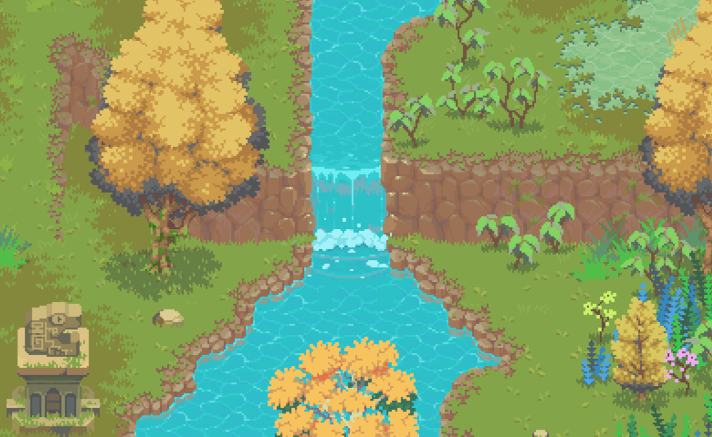

# Bevy Retro Camera

[](https://crates.io/crates/bevy_retro_camera)
[](https://docs.rs/bevy_retro_camera)
[](https://github.com/celerysaltgames/bevy_retro_camera)


<div align="center">
    <em>( Screenshot of <a href="https://katharostech.com/post/bounty-bros-on-web">Bounty Bros.</a> game made with Bevy Retrograde and <a href="https://github.com/katharostech/skipngo">Skip'n Go</a> )</em>
</div>



Bevy Retro camera is a 2D, pixel-perfect camera for Bevy. It is a continuation fork of the _RetroCameraBundle_ from [Bevy Retrograde](https://crates.io/crates/bevy_retrograde).

## Features

- Easy to configure camera optimized for 2D pixel-art rendering.
- Plugin that improve Bevy's rendering for pixel art.

## Quickstart
Create a startup system and use `RetroCameraBundle` to create a camera. It's also recommended to add the `RetroCameraPlugin` to disable the blur effect due to Bevy's default rendering configuration.

```rust
// Add RetroCameraPlugin to you app + a startup system
fn main() {
    App::new()
        .add_plugin(RetroCameraPlugin)
        .add_startup_system(setup)
}

// Configure your startup system like this
fn setup(mut commands: Commands) {
    commands.spawn_bundle(RetroCameraBundle::fixed_height(240.0));
}
```

## Compatibility matrix

| Bevy | bevy_retro_camera |
|------|-------------------|
| 0.8  | 1.0               |
